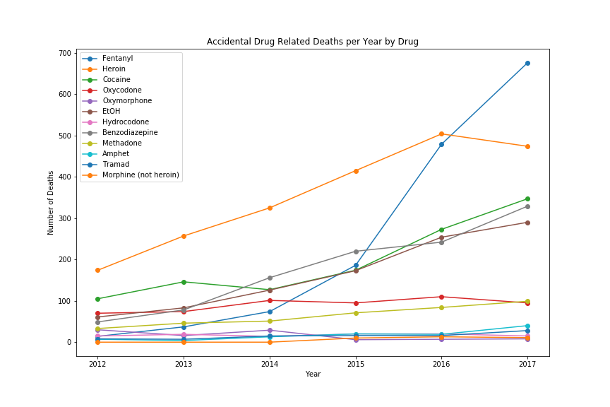

# **DataViz-Project1: Drug Mortality and Socio-Economic Conditions in Connecticut**     

### Extension
This is an extension to the project submitted as part of coursework submitted towards April 2018 UT Data Science and Visualization Bootcamp [https://github.com/krashilili/DataViz-Project1] (Project 1). The following extensions have been made.

1. Use line plot to visualize the number of deaths for each drug by year. This shows a previously unobserved treand that Heroin overdose deaths have come down in the last year. Impact of almost half the drugs is holding the same over years.

2. City-by-city visualization of the number of deaths.

3. Comparison between Rural and Urban area deaths. The classification of cities is from Census data. Connecticut is very urban (88%), but rural areas are very disproportionately affected.

| Classification | Number of Deaths | Population Ratio | Expected Deaths |   
|----------------|------------------|------------------|-----------------|
|  Rural         | 2217             | 12               | 489.48          |   
| Urban          | 1862             | 88               | 3589.52         |   
|                |                  |                  |                 | 

### Original Project Presentation
[Drug Mortality and Socio-Economic conditions in Connecticut.pptx](Original Powerpoint presentation)

### Project Proposal      
We are looking to analyze trends in drug overdose death rates in Connecticut and suggest improvements in data collection. And the research of the project aims to answer the following questions:    

**Is there a relationship between**  

* drug-induced mortality rates and income?   
* drug-induced mortality rates and age?    
* drug-induced mortality rates and education?    
* drug-induced mortality rates and gender?    
* drug-induced mortality rates and geo-location (counties)?    
* drug-induced mortality rates and unemployment rates?    
* drug-induced mortality rates and barriers to medical treatment?       

### Data Sources     

* [*Accidental Drug Overdose Related Deaths in Connecticut 2012-2017.csv*](https://catalog.data.gov/dataset/accidental-drug-related-deaths-january-2012-sept-2015).  (source:[Data.gov](https://catalog.data.gov/dataset))      
* *2016 Education Attainment Connecticut.csv* (source: [census.gov](https://www.census.gov/quickfacts/CT))     
* *2016 Employment Status by Age.csv*  (source: [census.gov](https://www.census.gov/quickfacts/CT))    
* *2016 Median Household Income County.csv* (source: [census.gov](https://www.census.gov/quickfacts/CT))   
* *FairfieldCountyPopulation.csv* (source: [census.gov](https://www.census.gov/quickfacts/CT))  
* *HartfordCountyPopulation.csv* (source: [census.gov](https://www.census.gov/quickfacts/CT))  
* *LitchfieldCountyPopulation.csv* (source: [census.gov](https://www.census.gov/quickfacts/CT))  
* *MiddlesexCountyPopulation.csv*  (source: [census.gov](https://www.census.gov/quickfacts/CT))  
* *NewHavenCountyPopulation.csv*  (source: [census.gov](https://www.census.gov/quickfacts/CT))  
* *NewLondonCountyPopulation.csv* (source: [census.gov](https://www.census.gov/quickfacts/CT))   
* *TollandCountyPopulation.csv* (source: [census.gov](https://www.census.gov/quickfacts/CT))  
* *WindhamCountyPopulation.csv* (source: [census.gov](https://www.census.gov/quickfacts/CT))  
* *PopByCountyByYear.csv*  (source: [factfinder.census.gov](https://factfinder.census.gov/faces/nav/jsf/pages/index.xhtml))  
* *tl_2010_09_county10.json*  (source: [factfinder.census.gov](https://factfinder.census.gov/faces/nav/jsf/pages/index.xhtml))   
* *Unemployment Rate by County.csv* (source: [BLS Public Data API](https://censusreporter.org/profiles/35000US72850-danbury-ct-metropolitan-necta/))     

